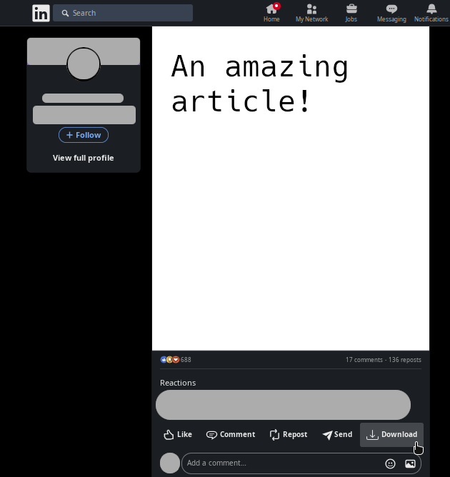

# Linkedin Tools

Chrome extension that brings more tools for Linkedin, like better downloads and other stuff.

[Download it here!](https://chrome.google.com/webstore/detail/linkedin-tools/kcnmjginaijndlfgmgkhgbjjjagnaipi)



# Features

* Download in a single click!
  * Article post as pdf  
  * Images  
  * Videos  
  * Post text
  * Poll's data
* Open up external media

# Development

## Build

```console
$ yarn install && yarn build
```

## Debug

1. Open chrome or similar and go to extensions: e.g. [chrome://extensions/](chrome://extensions/)
2. Enable `Developer mode`
3. Click on `Load unpacked`
4. Point to the `dist/` folder

# Acknowledgements

* [Linkedin icons created by Freepik - Flaticon](https://www.flaticon.com/free-icons/linkedin)
* [Bootstrap Download icon](https://icons.getbootstrap.com/icons/download/)

# TODO

* adjust download icon margin, still scuffed in some screen sizes
* make download multilpe images work
* Add context menu to download different types of data, text, image or others